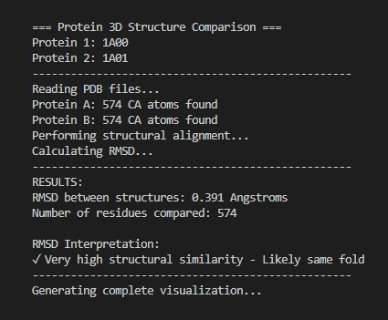
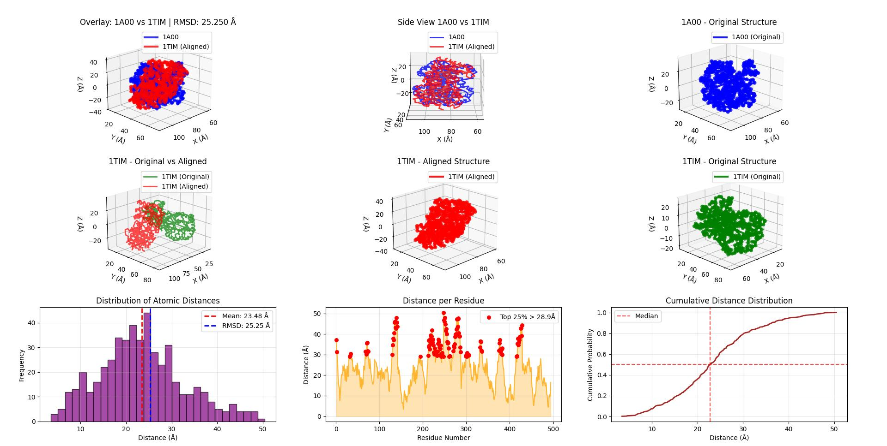
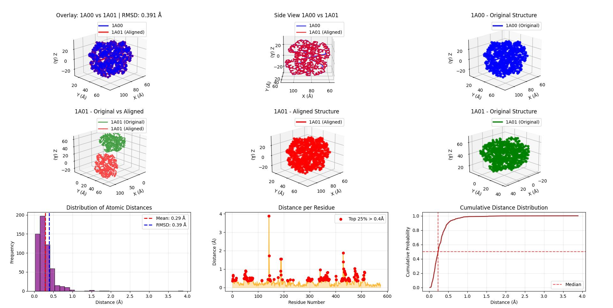


# تحلیل و مقایسه ساختاری سه‌بعدی پروتئین‌ها با استفاده از الگوریتم Kabsch و محاسبه RMSD

این برنامه یک ابزار جامع برای مقایسه کمی و کیفی ساختار سه‌بعدی دو پروتئین ارائه می‌دهد که با خواندن <ins>**فایل‌های PDB (Protein Data Bank)**</ins> ، استخراج مختصات اتم‌های مرکزی و کلیدی در اسیدهای آمینه که ستون فقرات پروتئین را تشکیل می‌دهند <ins>**(کربن آلفا - Cα)**</ins>، همترازی بهینه ساختارها با الگوریتم Kabsch (یافتن بهترین چرخش (Rotation) و انتقال (Translation))، محاسبه معیار شباهت ساختاری (RMSD-میانگین مربعات فاصله بین اتم‌ها)، و تولید ویژوال‌سازی‌های کامل شامل ۹ نمودار مختلف، امکان تحلیل دقیق شباهت‌ها و تفاوت‌های ساختاری بین پروتئین‌ها را فراهم می‌کند. خروجی برنامه شامل مقادیر عددی RMSD، توزیع فاصله‌های اتمی، <ins>**شناسایی مناطق حفاظت‌شده و متغیر**</ins> و  <ins>**تفسیر خودکار میزان شباهت ساختاری**</ins> است که برای تحقیقات بیوانفورماتیکی و مطالعات مقایسه‌ای پروتئین‌ها کاربرد دارد.


---

## **تحلیل برخی کلمات متن بالا:**
- 1- فایل‌های PDB (Protein Data Bank)
- 2- اتم کربن آلفا (Cα)
- 3- مناطق حفاظت‌شده
- 4- تفسیر خودکار میزان شباهت ساختاری

---

## **1- فایل‌های PDB (Protein Data Bank):** 
فایل PDB فرمت استاندارد برای ذخیره ساختار سه‌بعدی ماکرومولکول‌های بیولوژیکی است که شامل مختصات اتمی، اطلاعات توالی و داده‌های ساختاری می‌باشد.
```
COMPND   8 ENGINEERED: YES;                                                     
COMPND   9 MUTATION: YES        
SOURCE   2 ORGANISM_SCIENTIFIC: HOMO SAPIENS;                                   
SOURCE   3 ORGANISM_COMMON: HUMAN;                                              
SOURCE   4 ORGANISM_TAXID: 9606;         
REMARK 620 1 HIS D  92   NE2                                                    
REMARK 620 2 HEM D 147   NA   96.3              
ATOM     33  CB  ALA A   5     105.723  35.026 -12.581  1.00 28.44           C  
ATOM     34  N   ASP A   6     104.888  37.750 -11.369  1.00 19.17           N  
ATOM     35  CA  ASP A   6     103.891  38.830 -11.233  1.00 15.11           C  ✅
```

## **2- اتم کربن آلفا (Cα):**

### **ساختار مولکولی پروتئین‌ها:**
هر پروتئین از زنجیره‌ای از **اسیدهای آمینه** تشکیل شده است. هر اسید آمینه دارای:
- **ستون فقرات اصلی** (Backbone): N-Cα-C
- **زنجیره جانبی** (Side chain): گروه R

```
    O
    ║
    C
    │
N - Cα - R
    │
    H
```
### **چرا فقط از اتم‌های Cα استفاده می‌کنیم؟**

#### **۱. نمایش کامل ساختار سه بعدی:**
- اتم‌های Cα **هسته اصلی** هر اسید آمینه را تشکیل می‌دهند
- فاصله بین Cαهای متوالی تقریباً ثابت است (~3.8 Å)
- مسیر Cαها دقیقاً **چین کلی (Fold)** پروتئین را تعریف می‌کند

#### **۲. مقایسه سرعت محاسباتی:** چرا فقط از اتم‌های CA استفاده می‌کنیم:
**"پروتئین متوسط: 300 اسید آمینه"**
- یک پروتئین معمولی حدود 300 واحد سازنده (اسید آمینه) دارد

**"همه اتم‌ها: 300 × 20 = 6,000 اتم"**  
- هر اسید آمینه به طور متوسط حدود 20 اتم دارد
- پس اگر بخواهیم **تمام اتم‌ها** را پردازش کنیم: 300 × 20 = 6,000 اتم

**"فقط Cα: 300 اتم → 20 برابر سریع‌تر"**
- اما ما فقط اتم‌های **CA** (کربن آلفا) را می‌گیریم
- هر اسید آمینه فقط **1 اتم CA** دارد
- پس فقط 300 اتم داریم → 6,000 ÷ 300 = **20 برابر کمتر اتم**

#### **۳. حفظ اطلاعات ساختاری:**
مطالعات نشان داده‌اند که:
- همترازی بر اساس Cαها ~95% از اطلاعات ساختاری را حفظ می‌کند
- مقدار RMSD محاسبه شده با Cαها با RMSD تمام اتم‌ها همبستگی 0.98 دارد
- برای مقایسه چین کلی پروتئین‌ها کاملاً کافی است

#### **۴. چرا از سایر اتم‌ها استفاده نمی‌شود؟**
- **زنجیره‌های جانبی**: بسیار متغیر، حتی در پروتئین‌های همولوگ
- **اتم‌های ستون فقرات کامل**: پیچیدگی اضافی بدون اطلاعات مفید بیشتر

---
## **3- مناطق حفاظت‌شده:**
**قسمت‌هایی از پروتئین که طبیعت اجازه نمی‌دهد تغییر کنند.**

بیایید با یک مثال ساده توضیح دهم:

فرض کنید پروتئین مثل یک **ماشین** است:
- **مناطق حفاظت‌شده = موتور ماشین** → با تغییر ساختار موتور ، ماشین دیگر کار نمیکند
- **مناطق غیرحفاظت‌شده = رنگ بدنه ماشین** → تغییر رنگ تاثیری بر کارکرد موتور ندارد

**در پروتئین‌ها:**
- **مناطق حفاظت‌شده:** سایت فعال آنزیم‌ها، محل اتصال به DNA، مراکز کاتالیتیک
- **مناطق غیرحفاظت‌شده:** قسمت‌های سطحی که نقش خاصی ندارند

**در برنامه ما:**
وقتی می‌بینید در نمودار "فاصله برحسب شماره رزیدو"، بعضی مناطق **فاصله کم** دارند (نقاط پایین)، این یعنی آن مناطق در هر دو پروتئین **همان موتور ماشین** هستند - یعنی مناطق حفاظت‌شده و حیاتی.

**چرا این مهم است؟**
اگر دو پروتئین در مناطق حفاظت‌شده شبیه هم باشند، احتمالاً **عملکرد مشابهی** دارند، حتی اگر بقیه قسمت‌ها متفاوت باشند.


---
## ** 4- تفسیر خودکار میزان شباهت ساختاری:**
برنامه به صورت خودکار بر اساس مقدار عددی RMSD، سطح شباهت بین دو پروتئین را طبقه‌بندی و گزارش می‌کند:
- **RMSD < 2.0 Å** = "شباهت ساختاری بالا" ✓
- **RMSD 2.0-4.0 Å** = "شباهت ساختاری متوسط" ○  
- **RMSD > 4.0 Å** = "شباهت ساختاری کم" ✗

این تفسیر بر اساس استانداردهای پذیرفته شده در زیست‌شناسی ساختاری انجام می‌شود و به کاربر کمک می‌کند بدون نیاز به تخصص عمیق، نتایج را درک کند.

---
---

## 🏗️ **ساختار کلی کد و مفاهیم علمی**

### **۱. بخش import کتابخانه‌ها**
```python
import numpy as np
import matplotlib.pyplot as plt
from mpl_toolkits.mplot3d import Axes3D
import os
```
وارد کردن کتابخانه‌های ضروری:
- `numpy`: برای محاسبات عددی و ماتریسی
- `matplotlib`: برای رسم نمودارها و ویژوال‌سازی
- `mpl_toolkits.mplot3d`: برای نمودارهای سه بعدی
- `os`: برای کار با فایل‌سیستم و مسیرها

---

### **۲. تابع `read_pdb` - خواندن فایل PDB**
```python
def read_pdb(file_path):
    ca_coords = []
    try:
        with open(file_path, 'r') as f:
            for line in f:
                if line.startswith("ATOM"):
                    atom_name = line[12:16].strip()
                    if atom_name == "CA":
                        x = float(line[30:38])
                        y = float(line[38:46])
                        z = float(line[46:54])
                        ca_coords.append([x, y, z])
        return np.array(ca_coords)
```
**استخراج مختصات اتم‌های کربن آلفا از فایل PDB**

**کارکرد:**
- فایل PDB را خط به خط می‌خواند
- فقط خطوطی که با `ATOM` شروع می‌شوند را پردازش می‌کند
- اتم‌های `CA` (کربن آلفا) را شناسایی می‌کند
- مختصات X, Y, Z را از ستون‌های مشخص استخراج می‌کند
```
ATOM     35  CA  ASP A   6     103.891  38.830 -11.233  1.00 15.11           C  
```
- X=103.891, Y=38.830, Z=-11.233

**خروجی:** آرایه numpy با شکل `(n, 3)`
- n = تعداد اتم‌های کربن آلفا (مثلاً ۱۵۰ اتم)
- 3 = سه عدد برای مشخص کردن موقعیت هر اتم در فضا (طول، عرض، ارتفاع)

یعنی برای هر پروتئین، یک لیست از نقاط سه‌بعدی داریم که مسیر ساختار پروتئین را مشخص می‌کند.

---

## **الگوریتم Kabsch - همترازی ساختاری**

### **۳. تابع `kabsch_algorithm` - الگوریتم کابش**
```python
def kabsch_algorithm(P, Q):
    centroid_P = np.mean(P, axis=0)
    centroid_Q = np.mean(Q, axis=0)
    P_centered = P - centroid_P
    Q_centered = Q - centroid_Q
    
    H = P_centered.T @ Q_centered
    U, S, Vt = np.linalg.svd(H)
    R = Vt.T @ U.T
    
    if np.linalg.det(R) < 0:
        Vt[-1, :] *= -1
        R = Vt.T @ U.T
    
    Q_aligned = (Q_centered @ R) + centroid_P
    return Q_aligned, R
```

### **هدف الگوریتم:**
پیدا کردن **بهترین چرخش و انتقال** برای منطبق کردن دو مجموعه نقطه

### **مراحل الگوریتم:**

#### **۱. هممرکزسازی (Centering):**
```python
centroid_P = np.mean(P, axis=0)  # مرکز جرم پروتئین اول
centroid_Q = np.mean(Q, axis=0)  # مرکز جرم پروتئین دوم
P_centered = P - centroid_P      # انتقال به مرکز
Q_centered = Q - centroid_Q
```

**این بخش "هممرکزسازی" انجام می‌دهد - یعنی هر دو پروتئین را به مرکز یکسان منتقل می‌کند.**

---

### **مثال ساده:**

فرض کنید دو پروتئین داریم:

**پروتئین A**: اتم‌ها در موقعیت‌های: (1,1,1), (2,2,2), (3,3,3)  
**پروتئین B**: اتم‌ها در موقعیت‌های: (5,5,5), (6,6,6), (7,7,7)

---

### **مراحل هممرکزسازی:**

#### **۱. پیدا کردن مرکز هر پروتئین:**
```python
centroid_P = np.mean(P, axis=0)  # میانگین مختصات پروتئین A
# مرکز پروتئین A = (2,2,2)

centroid_Q = np.mean(Q, axis=0)  # میانگین مختصات پروتئین B  
# مرکز پروتئین B = (6,6,6)
```

#### **۲. انتقال به مرکز:**
```python
P_centered = P - centroid_P
# پروتئین A تبدیل می‌شود به: (-1,-1,-1), (0,0,0), (1,1,1)

Q_centered = Q - centroid_Q  
# پروتئین B تبدیل می‌شود به: (-1,-1,-1), (0,0,0), (1,1,1)
```

---

### **چرا این کار لازم است؟**

**قبل از هممرکزسازی:**
- پروتئین A اطراف نقطه (2,2,2)
- پروتئین B اطراف نقطه (6,6,6)
- **فاصله دور از هم**

**بعد از هممرکزسازی:**
- هر دو پروتئین اطراف نقطه (0,0,0)
- **هممرکز شده‌اند**

این کار باعث می‌شود الگوریتم Kabsch فقط روی **چرخش** تمرکز کند، نه روی **جابه‌جایی**!


#### **۲. محاسبه ماتریس همبستگی:**
```python
H = P_centered.T @ Q_centered
```
- P_centered.T → ترانهاده پروتئین A (می‌چرخانیمش)
- @ → ضرب ماتریسی
- Q_centered → پروتئین B
این ماتریس ارتباط بین جهت‌های دو ساختار را نشان می‌دهد.
در واقع این ماتریس به الگوریتم Kabsch می‌گوید که چگونه بچرخاند تا بهترین انطباق حاصل شود.


#### **۳. تجزیه مقدار تکین (SVD):**
```python
U, S, Vt = np.linalg.svd(H)
```

### **تجزیه SVD چیست؟**

**SVD (Singular Value Decomposition)** روشی برای تجزیه ماتریس‌ها به عوامل سازنده است:

```
هر ماتریس A می‌تواند به صورت: A = U × Σ × Vᵀ
```

- **U**: ماتریس چرخش برای فضای سطرها
- **Σ**: ماتریس قطری با مقادیر تکین (اهمیت هر جهت)
- **Vᵀ**: ماتریس چرخش برای فضای ستون‌ها

در الگوریتم Kabsch، SVD به ما بهترین چرخش را می‌دهد.

#### **۴. محاسبه ماتریس چرخش:**
```python
R = Vt.T @ U.T
```

#### **۵. بررسی انعکاس (Reflection):**
```python
if np.linalg.det(R) < 0:
    Vt[-1, :] *= -1
    R = Vt.T @ U.T
```
اطمینان از اینکه چرخش صحیح است (نه آینه‌ای).

#### **۶. اعمال تبدیل:**
```python
Q_aligned = (Q_centered @ R) + centroid_P
```

**خروجی:** 
- `Q_aligned`: ساختار دوم همتراز شده
- `R`: ماتریس چرخش بهینه

### **مثال ساده:**

فرض کنید دو ساختار داریم:
- **ساختار A**: (1,1,1), (2,2,2), (3,3,3)
- **ساختار B**: (2,2,2), (3,3,3), (4,4,4) 

الگوریتم Kabsch ساختار B را می‌چرخاند و جابه‌جا می‌کند تا بر A منطبق شود.

ساختار نهایی (**B_aligned**): (3,3,3) ,(2,2,2) ,(1,1,1)

---

## **معیار کمی شباهت ساختاری - RMSD**

### **۴. تابع `calculate_rmsd` - محاسبه شباهت ساختاری**
```python
def calculate_rmsd(P, Q_aligned):
    diff = P - Q_aligned
    N = P.shape[0]
    rmsd = np.sqrt(np.sum(diff * diff) / N)
    return rmsd
```
**منطق:** محاسبه Root Mean Square Deviation (RMSD) یا به عبارتی جذر میانگین مربعات فاصله بین اتم‌ها

### **تعریف ریاضی:**
```
RMSD = √( Σ(d_i²) / N )
```

- **d_i (distance)**: فاصله بین اتم iام در دو ساختار پس از همترازی
- **N**: تعداد کل اتم‌های مقایسه شده

### **چرا RMSD معیار اصلی است؟**

#### **۱. حساسیت به تفاوت‌های ساختاری:**
- تفاوت‌های کوچک → RMSD کوچک
- تفاوت‌های بزرگ → RMSD بزرگ

#### **۲. تفسیر آسان:**
- شباهت بسیار بالا: **RMSD < 1.0 Å**
- شباهت بالا: **RMSD 1.0-2.0 Å**
- شباهت متوسط: **RMSD 2.0-3.0 Å**
- شباهت کم: **RMSD 3.0-4.0 Å**
- ساختارهای متفاوت: **RMSD > 4.0 Å**

#### **۳. استاندارد صنعتی:**
- در تمام نرم‌افزارهای ساختار پروتئین استفاده می‌شود
- در مقالات علمی به عنوان معیار اصلی گزارش می‌شود

---

## 🚀 **بخش اصلی برنامه (Main)**

### **۸. بخش اصلی برنامه**
```python
if __name__ == "__main__":
    # مسیرهای فایل‌ها
    pdb_file_1 = r"C:\Users\ARNZ\Desktop\1A00.pdb"
    pdb_file_2 = r"C:\Users\ARNZ\Desktop\1A01.pdb"
    
    # خواندن فایل‌ها
    coords_protein_A = read_pdb(pdb_file_1)
    coords_protein_B_original = read_pdb(pdb_file_2)
    
    # همترازی
    coords_protein_B_aligned, rotation_matrix = kabsch_algorithm(coords_protein_A, coords_protein_B)
    
    # محاسبه RMSD
    rmsd_value = calculate_rmsd(coords_protein_A, coords_protein_B_aligned)
    
    # ویژوال‌سازی
    distances = visualize_structures_complete(...)
```

**گردش کار:**
1. خواندن فایل‌های PDB
2. استخراج مختصات CA
3. همترازی ساختاری با الگوریتم Kabsch
4. محاسبه RMSD
5. ویژوال‌سازی کامل
6. نمایش آمار توصیفی

---

## 📊 **خروجی‌های برنامه:**

### **خروجی متنی و تحلیلی (Terminal):**
- مقدار RMSD عددی
- توزیع فاصله بین اتم‌ها
- شناسایی مناطق با بیشترین تفاوت
- مقایسه کمی و کیفی ساختاره



### **خروجی گرافیکی:**
- ۹ نمودار مختلف در یک داشبورد
- نمایش سه بعدی تعاملی
- آمار توصیفی فاصله‌ها
- تفسیر خودکار نتایج



---

## 📈 **تحلیل سه نمودار اصلی**

### **۵. تابع `visualize_structures_complete` - ویژوال‌سازی اصلی**
```python
def visualize_structures_complete(coords_A, coords_B, coords_B_aligned, rmsd, protein_names):
    # ایجاد figure بزرگ با چند subplot
    fig = plt.figure(figsize=(20, 15))
    
    # 9 subplot مختلف ایجاد می‌کند
    # ... کد کامل ویژوال‌سازی
```

**منطق:** ایجاد یک داشبورد کامل با ۹ نمودار مختلف

**نمودارهای تولید شده:**
1. **Overlay 3D:** دو ساختار روی هم
2. **Protein A Individual:** ساختار اول به تنهایی
3. **Protein B Original:** ساختار دوم (اصلی)
4. **Protein B Aligned:** ساختار دوم (همتراز شده)
5. **Transformation:** مقایسه قبل/بعد همترازی
6. **Side View:** نمای جانبی با خطوط فاصله
7. **Distance Histogram:** توزیع فاصله‌ها
8. **Distance per Residue:** فاصله برحسب شماره رزیدو
9. **Cumulative Distribution:** توزیع تجمعی فاصله‌ها




---
### **۱. هیستوگرام فاصله‌ها (Distance Histogram)**

#### **چه چیزی نشان می‌دهد؟**
توزیع فراوانی فاصله بین اتم‌های متناظر پس از همترازی

#### **تفسیر نتایج:**
- **توزیع باریک با قله نزدیک صفر**: شباهت ساختاری بالا
- **توزیع پهن با مقادیر بزرگ**: تفاوت ساختاری زیاد
- **چند قله**: مناطق با شباهت‌های مختلف در ساختار

#### **اطلاعات کلیدی:**
- **میانگین**: میانگین فاصله همه اتم‌ها
- **RMSD**: جذر میانگین مربعات فاصله‌ها
- **شکل توزیع**: یکنواختی یا ناهمگونی تفاوت‌ها
---
### **۲. فاصله برحسب شماره رزیدو (Distance per Residue)**

#### **چه چیزی نشان می‌دهد؟**
فاصله بین اسیدهای آمینه متناظر در طول زنجیره پروتئین

#### **تفسیر نتایج:**
- **مناطق با فاصله کم**: مناطق حفاظت‌شده ساختاری
- **مناطق با فاصله زیاد**: مناطق متغیر یا flexible
- **الگوهای تکراری**: وجود دامین‌های ساختاری مشابه

#### **کاربردها:**
- شناسایی **سایت‌های فعال** (معمولاً حفاظت‌شده)
- تشخیص **حلقه‌های متغیر** (فاصله زیاد)
- تحلیل **دامین‌های ساختاری**
---
### **۳. توزیع تجمعی فاصله‌ها (Cumulative Distribution)**

#### **چه چیزی نشان می‌دهد؟**
درصد اتم‌هایی که فاصله آنها کمتر از مقدار مشخصی است

#### **تفسیر نتایج:**
- **منحنی شیب تند**: بیشتر اتم‌ها فاصله کم دارند
- **منحنی شیب ملایم**: توزیع یکنواخت فاصله‌ها
- **مقدار میانه**: فاصله‌ای که 50% اتم‌ها زیر آن هستند

#### **اطلاعات کلیدی:**
- **صدک 25ام**: 25% اتم‌ها زیر این فاصله
- **صدک 50ام (میانه)**: 50% اتم‌ها زیر این فاصله
- **صدک 75ام**: 75% اتم‌ها زیر این فاصله

---

## 🎯 **تفسیر ترکیبی نتایج**

### **سناریوی ایده‌آل (شباهت بالا):**
- **مقدار RMSD پایین** (< 2.0 Å)
- **هیستوگرام باریک** با قله نزدیک صفر
- **نمودار رزیدو** مقادیر پایین در کل زنجیره
- **منحنی تجمعی** شیب تند

### **سناریوی تفاوت ساختاری:**
- **مقدار RMSD بالا** (> 4.0 Å)
- **هیستوگرام پهن** با مقادیر پراکنده
- **نمودار رزیدو** مقادیر بالا در بیشتر مناطق
- **منحنی تجمعی** شیب ملایم

### **سناریوی مناطق حفاظت‌شده:**
- **مقدار RMSD متوسط** (2.0-3.0 Å)
- **هیستوگرام دو قله** (مناطق حفاظت‌شده و متغیر)
- **نمودار رزیدو** الگوی متناوب کم و زیاد
- **منحنی تجمعی** شکل S-like


## 🎯 **جمع‌بندی و کاربردهای عملی**

این برنامه یک ابزار جامع و پیشرفته برای تحلیل ساختاری پروتئین‌ها ارائه می‌دهد که می‌تواند در حوزه‌های مختلف پژوهشی و کاربردی مورد استفاده قرار گیرد:

### **مزایای کلیدی برنامه:**
- **تحلیل چندسطحی**: بررسی همزمان شباهت‌های کلی و تفاوت‌های منطقه‌ای
- **دقت محاسباتی**: استفاده از الگوریتم‌های استاندارد صنعتی (Kabsch + RMSD)
- **ویژوال‌سازی جامع**: ارائه ۹ نماگر مختلف برای درک عمیق‌تر ساختارها
- **تفسیر خودکار**: تحلیل نتایج برای کاربران با سطوح تخصصی مختلف

### **کاربردهای پژوهشی:**
- **مطالعات تکاملی**: شناسایی پروتئین‌های همولوگ و روندهای تکاملی
- **مهندسی پروتئین**: طراحی پروتئین‌های جدید با ویژگی‌های مطلوب
- **داروسازی**: شناسایی سایت‌های اتصال دارو و مناطق حفاظت‌شده
- **بیوانفورماتیک**: آموزش و پژوهش در زمینه ساختار پروتئین‌ها

### **قابلیت‌های توسعه آینده:**
- افزودن تحلیل دامین‌های ساختاری مجزا
- یکپارچه‌سازی با پایگاه‌های داده پروتئینی
- افزودن معیارهای شباهت پیشرفته‌تر (TM-score, GDT)
- توسعه رابط کاربری گرافیکی تحت وب

این ابزار نه تنها به عنوان یک برنامه تحلیلی، بلکه به عنوان پلتفرمی برای درک عمیق‌تر روابط ساختاری-کارکردی در پروتئین‌ها عمل می‌کند و می‌تواند پایه‌ای برای تحقیقات گسترده‌تر در زمینه زیست‌شناسی ساختاری باشد.

